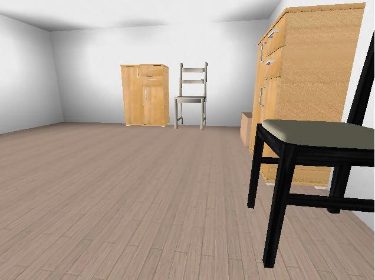
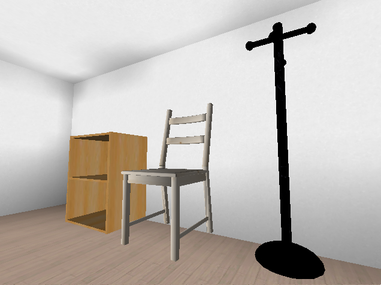
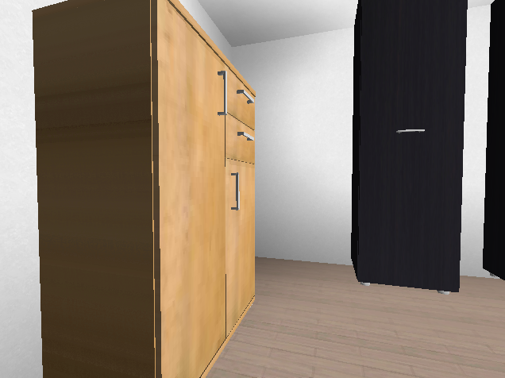

# DMHouse 
*DMHouse* is a fork of [DeepMind Lab 3D simulator](https://github.com/deepmind/lab), modified for indoor visual navigation.

<div align="center">



  <br /><br />
</div>

## Getting started
Before getting started, please ensure you have all required packages installed (SDL2, python3.8, OSMesa, gettext).
On ubuntu you can issue the following command:
```bash
$ sudo apt install -y libsdl2-dev python3.8-dev python3.8-numpy libosmesa6-dev gettext
```
Alternatively, you can use the provided docker image with pre-installed environment.

You can install this package from the PyPI repository.
```bash
$ pip install dmhouse
```

The package provides a *gym* interface. Here is an example, which shows how to create a new environment instance.
```python
import dmhouse  # Required to register environments to gym
import gym

env = gym.make('DMHouse-v1', screen_size=(84, 84), renderer='hardware')
```

NOTE: for better performance, you should use `renderer='hardware'`, other option is `renderer='software'`

## About
The primary purpose of 3DHouse is to act as a testbed for research in artificial intelligence,
especially deep reinforcement learning visual navigation.
This fork modifies DeepMind Lab to be suitable for visual navigation in indoor environments.
It adds new scenes and office-like 3D objects and also removes game-like animations and on-screen artifacts.

If you use *DMHouse* in your research and would like to cite us, you can use the following citation:
```bibtex
@article{kulhanek2020visual,
  title={Visual Navigation in Real-World Indoor Environments Using End-to-End Deep Reinforcement Learning},
  author={Kulh{\'a}nek, Jon{\'a}{\v{s}} and Derner, Erik and Babu{\v{s}}ka, Robert},
  journal={arXiv preprint arXiv:2010.10903},
  year={2020}
}
```

You can also cite the *DeepMind Lab* environment by citing the [DeepMind Lab paper](https://arxiv.org/abs/1612.03801).

If you have any questions, you can reach me at [jonas.kulhanek@live.com](mailto:jonas.kulhanek@live.com) 
or the authors of DeepMind Lab at [lab@deepmind.com](mailto:lab@deepmind.com).

## Extending DMHouse simulator
### Getting started
First, clone this repository by running:
```shell
$ git clone https://github.com/jkulhanek/dmlab-vn
$ cd lab
```

Get started by installing the required packages. On ubuntu, you can do it using the following command:
```bash
$ sudo apt install -y libsdl2-dev python3.8-dev python3.8-numpy libosmesa6-dev
$ sudo apt install -y curl gnupg
$ curl -fsSL https://bazel.build/bazel-release.pub.gpg | gpg --dearmor > bazel.gpg
$ sudo mv bazel.gpg /etc/apt/trusted.gpg.d/
$ echo "deb [arch=amd64] https://storage.googleapis.com/bazel-apt stable jdk1.8" | sudo tee /etc/apt/sources.list.d/bazel.list
$ sudo apt update -y
$ sudo apt install -y bazel
```
Alternatively, you can used the pre-installed docker image.

### Building pip package
To build the pip package, run the following commands:
```bash
$ bazel build -c opt --define graphics=osmesa_or_egl //python/pip_package:build_pip_package
$ ./bazel-bin/python/pip_package/build_pip_package /tmp/dmlab_pkg
```

The package can be installed using the following command:
``` 
$ pip install /tmp/dmlab_pkg/dmhouse-*-py3-none-any.whl
```


## Upstream sources
*DMHouse* is built on top of DeepMind's Lab 3D simulator, which is in turn
 built from the *ioquake3* game engine, and it uses the tools *q3map2* and
 *bspc* for map creation.

* *DeepMind Lab* is taken from [github.com/deepmind/lab](https://github.com/deepmind/lab).

* *bspc* is taken from [github.com/TTimo/bspc](https://github.com/TTimo/bspc),
  revision d9a372db3fb6163bc49ead41c76c801a3d14cf80. There are virtually no
  local modifications, although we integrate this code with the main ioq3 code
  and do not use their copy in the `deps` directory. We expect this code to be
  stable.

* *q3map2* is taken from
  [github.com/TTimo/GtkRadiant](https://github.com/TTimo/GtkRadiant),
  revision d3d00345c542c8d7cc74e2e8a577bdf76f79c701. A few minor local
  modifications add synchronization. We also expect this code to be stable.

* *ioquake3* is taken from
  [github.com/ioquake/ioq3](https://github.com/ioquake/ioq3),
  revision 29db64070aa0bae49953bddbedbed5e317af48ba. The code contains extensive
  modifications and additions.

* EGL headers are included in this package by DeepMind's Lab (in
   `//third_party/GL/{`[`EGL`](third_party/GL/EGL)`,`[`KHR`](third_party/GL/KHR)`}`),
   taken from the Khronos OpenGL/OpenGL ES XML API Registry at
   [www.khronos.org/registry/EGL](http://www.khronos.org/registry/EGL/). The
   headers have been modified slightly to remove the dependency of EGL on X.

We are very grateful to the maintainers of these repositories for all their hard
work on maintaining high-quality code bases.
